# House Price Prediction — End-to-End ML Web App

An end-to-end machine learning product that predicts house prices for
Indian real estate listings: a Jupyter notebook cleans the data and trains
the model, a FastAPI backend serves predictions, and a React frontend lets
a user enter property details and get an instant price estimate.

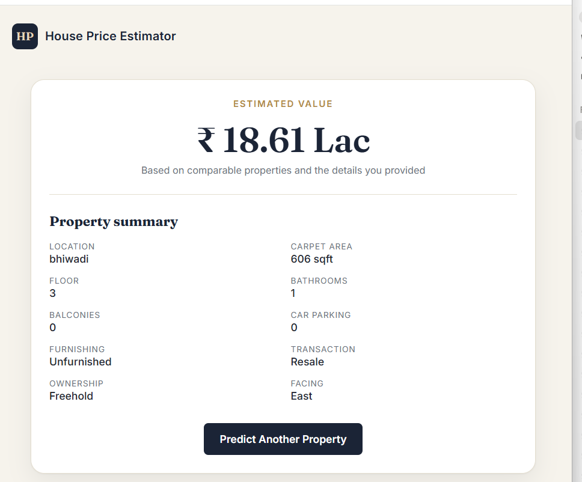

## Overview

Given details about a property (location, carpet area, floor, number of
bathrooms/balconies, furnishing status, etc.), the app predicts an
estimated market price in INR. The model is trained on ~187,000 real
estate listings scraped from across India.

**Pipeline:** raw CSV → cleaning & feature engineering → model training &
comparison → exported scikit-learn pipeline → FastAPI inference service →
React form → predicted price.

## Architecture

```
┌─────────────────┐        HTTP (JSON)        ┌──────────────────┐        joblib.load
│  React Frontend │  ───────────────────────▶ │  FastAPI Backend │ ─────────────────────▶ ┌──────────────────┐
│  (Vite + TS)    │  ◀─────────────────────── │  (Uvicorn)       │                        │ house_price.pkl   │
│  localhost:5173 │      predicted_price       │  localhost:8000  │ ◀───────────────────── │ (sklearn Pipeline)│
└─────────────────┘                            └──────────────────┘                        └──────────────────┘
                                                         ▲
                                                         │ trained & exported by
                                                         │
                                                ┌──────────────────┐
                                                │  Jupyter Notebook │
                                                │  (cleaning, EDA,  │
                                                │  training, export)│
                                                └──────────────────┘
```

## Tech Stack

| Layer | Technology |
|---|---|
| Data & modeling | Python, pandas, numpy, scikit-learn, matplotlib, seaborn, Jupyter |
| Backend | FastAPI, Uvicorn, Pydantic, joblib |
| Frontend | React, TypeScript, Vite, react-router-dom |
| Tooling | Git, GitHub, pytest |

## Project Structure

```
house-price-project/
├── notebooks/
│   ├── house_price_model.ipynb   # cleaning, EDA, training, evaluation, export
│   └── data/                     # raw dataset (not committed — see below)
├── backend/
│   ├── app/
│   │   ├── main.py               # FastAPI app, CORS, startup model loading
│   │   ├── api/routes/prediction.py
│   │   ├── core/config.py
│   │   ├── schemas/prediction.py
│   │   ├── services/
│   │   │   ├── preprocessing.py
│   │   │   └── inference.py
│   │   └── utils/logging_config.py
│   ├── models/                   # house_price.pkl + locations.json
│   ├── tests/test_prediction.py
│   ├── requirements.txt
│   ├── .env.example
│   └── Dockerfile
├── frontend/
│   └── src/
│       ├── api/predictionClient.ts
│       ├── components/PredictionForm.tsx
│       ├── pages/HomePage.tsx | ResultPage.tsx | NotFoundPage.tsx
│       ├── types/prediction.ts
│       └── App.tsx
├── screenshots/
├── .gitignore
└── README.md
```

## Dataset

**[House Price](https://www.kaggle.com/datasets/juhibhojani/house-price)**
by Juhi Bhojani on Kaggle — ~187,000 real estate listings across India.

The raw CSV is **not committed** to this repo (it's ~106 MB). To get it:

1. Create a free [Kaggle account](https://www.kaggle.com) if you don't have one
2. Download the dataset from the link above (or use the Kaggle CLI)
3. Place `house_prices.csv` inside `notebooks/data/`

```
notebooks/
  data/
    house_prices.csv
```

## Setup & Run

### 1. Notebook (train the model)

```bash
cd notebooks
pip install jupyter pandas numpy scikit-learn matplotlib seaborn
jupyter notebook
```

Open `house_price_model.ipynb` and run all cells. This produces
`house_price.pkl` and `locations.json` inside `notebooks/`.

Copy them into the backend:
```bash
copy notebooks\house_price.pkl backend\models\
copy notebooks\locations.json backend\models\
```

### 2. Backend (FastAPI)

```bash
cd backend
python -m venv .venv
.venv\Scripts\activate          # macOS/Linux: source .venv/bin/activate
pip install -r requirements.txt
copy .env.example .env
uvicorn app.main:app --reload
```

The API runs at `http://localhost:8000`. Interactive docs at
`http://localhost:8000/docs`.

### 3. Frontend (React + Vite)

```bash
cd frontend
npm install
npm run dev
```

The app runs at `http://localhost:5173`.

## Environment Variables

**Backend (`backend/.env`)**

| Variable | Description | Example |
|---|---|---|
| `MODEL_PATH` | Path to the exported model | `models/house_price.pkl` |
| `LOCATIONS_PATH` | Path to the allowed locations list | `models/locations.json` |
| `CORS_ORIGINS` | Allowed frontend origin(s) | `http://localhost:5173` |
| `APP_NAME` | API display name | `House Price Prediction API` |

**Frontend (`frontend/.env`)**

| Variable | Description | Example |
|---|---|---|
| `VITE_API_BASE_URL` | Backend base URL | `http://localhost:8000` |

## API Reference

### `GET /health`
Health check.

```bash
curl http://localhost:8000/health
```
```json
{ "status": "ok" }
```

### `POST /predict`
Returns a predicted price for a given property.

```bash
curl -X POST http://localhost:8000/predict \
  -H "Content-Type: application/json" \
  -d '{
        "location": "mumbai",
        "carpet_area_sqft": 850,
        "floor_num": 3,
        "bathroom": 2,
        "balcony": 1,
        "car_parking": 1,
        "furnishing": "Semi-Furnished",
        "transaction": "Resale",
        "ownership": "Freehold",
        "facing": "East"
      }'
```
```json
{ "predicted_price": 1861234.56 }
```

## Model Results

Three models were trained and compared on a held-out 20% test set (trained
on `log1p(price)`, evaluated on the original price scale):

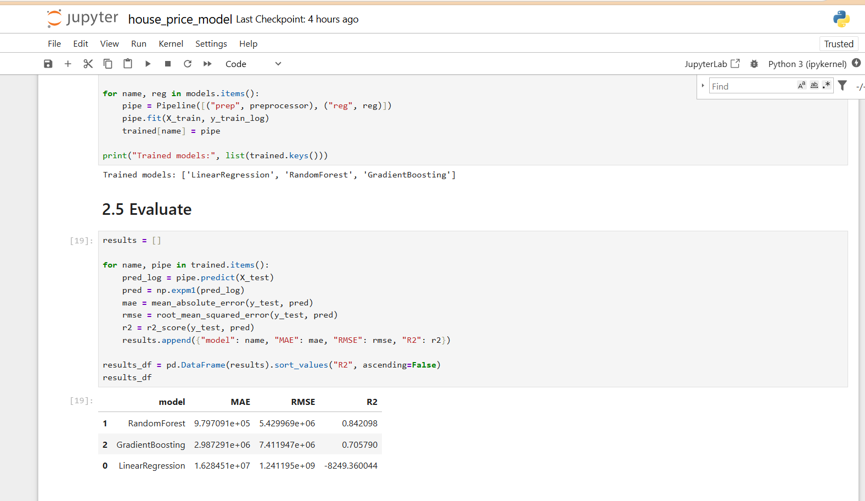

| Model | MAE (INR) | RMSE (INR) | R² |
|---|---|---|---|
| **Random Forest** | **979,709** | **5,429,969** | **0.842** |
| Gradient Boosting | 2,987,291 | 7,411,947 | 0.706 |
| Linear Regression | 16,284,510 | 1,241,195,000 | -8249.36 |

**Random Forest is the winning model**, explaining ~84% of the variance in
price (R² = 0.842) with the lowest MAE and RMSE by a wide margin. Gradient
Boosting performed reasonably but with roughly 3x higher error. Linear
Regression failed badly (a strongly negative R²), confirming that the
relationship between property features and price is highly non-linear —
tree-based ensembles are much better suited to this dataset.

## Screenshots

### App

| Form | Result |
|---|---|
| 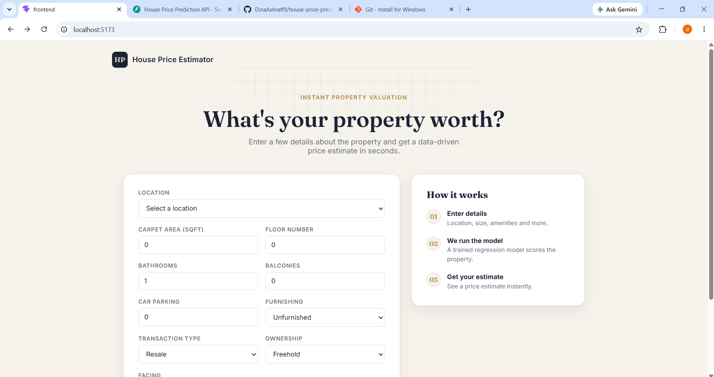 |  |

### API (Swagger UI)

| /docs overview | /health | /predict response |
|---|---|---|
| 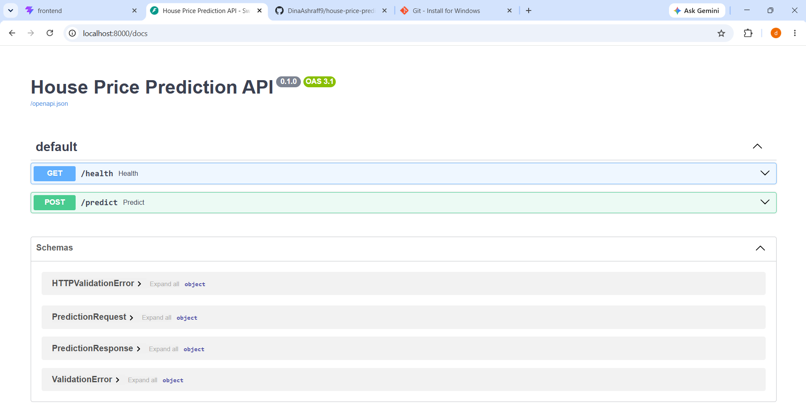 | 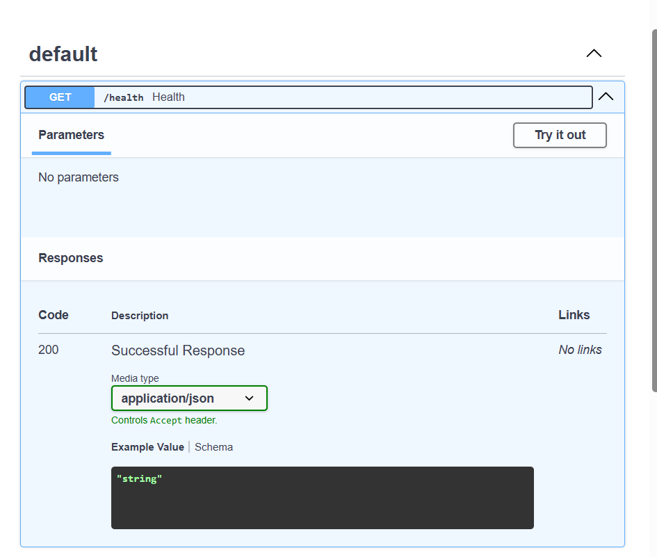 | 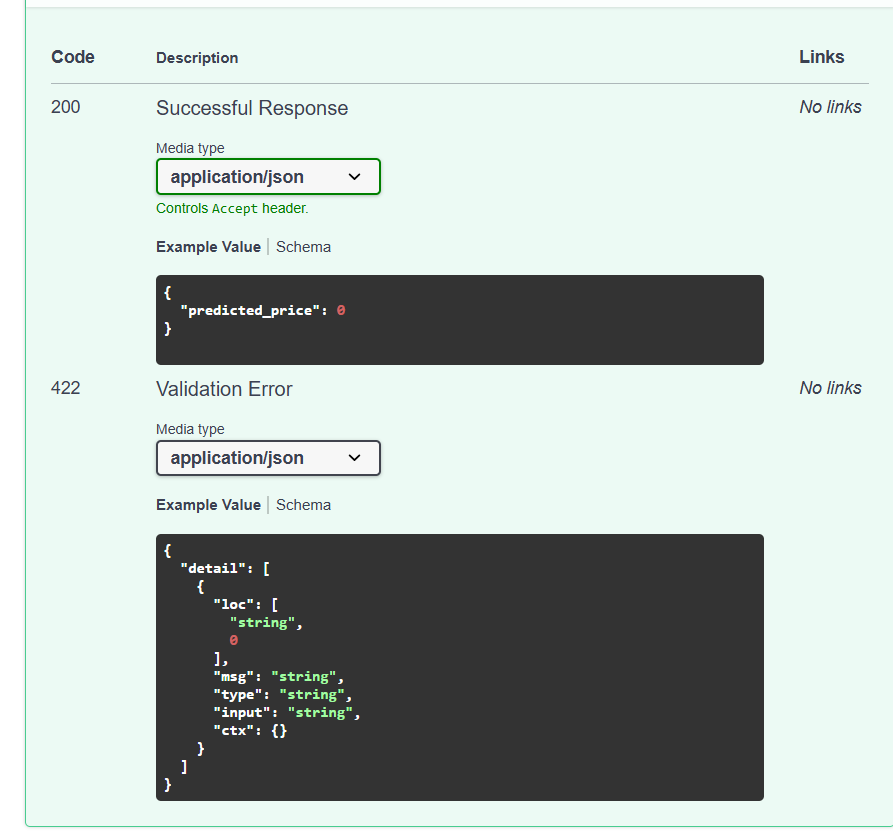 |

### Exploratory Data Analysis

| Missing values | Price distribution (log scale) |
|---|---|
| 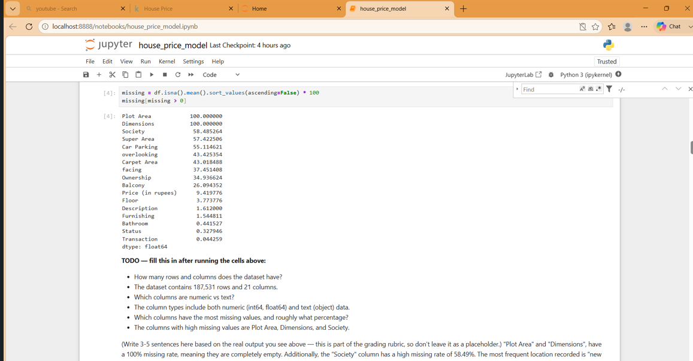 | 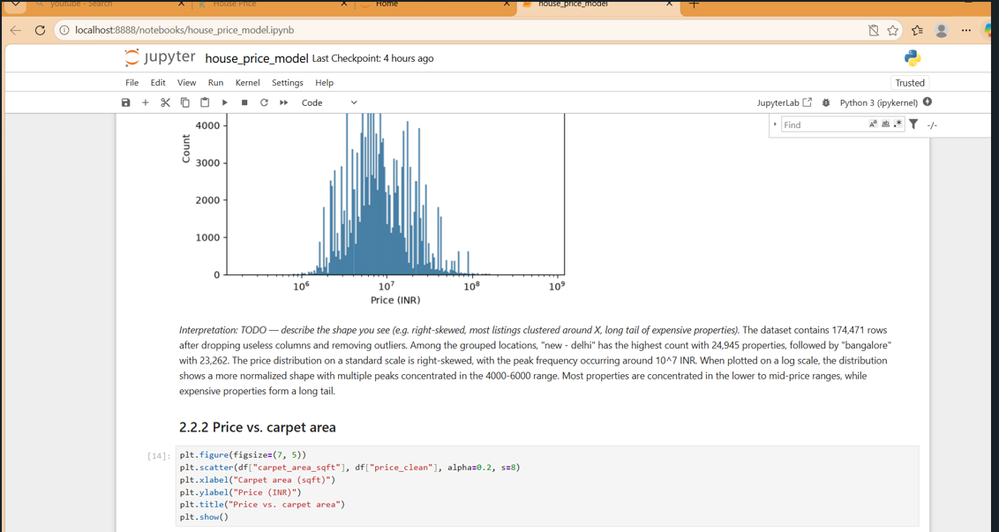 |

| Price vs. carpet area | Average price by top-15 locations |
|---|---|
| 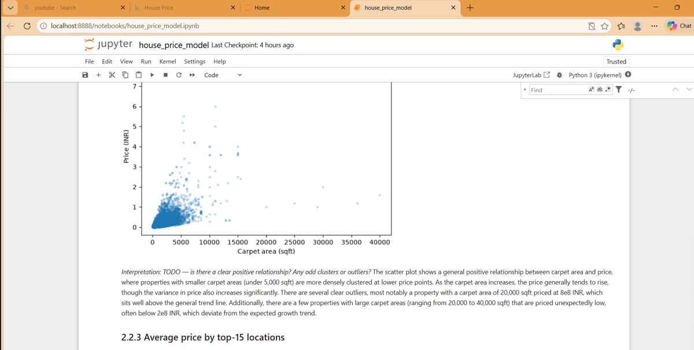 | 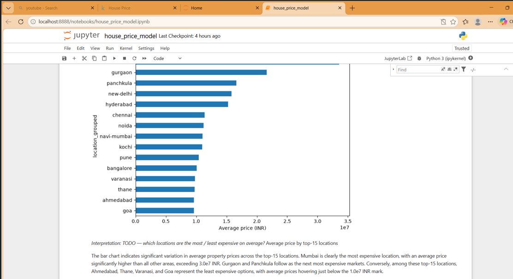 |

| Price by furnishing / bathrooms | Predicted vs. actual (Random Forest) |
|---|---|
| 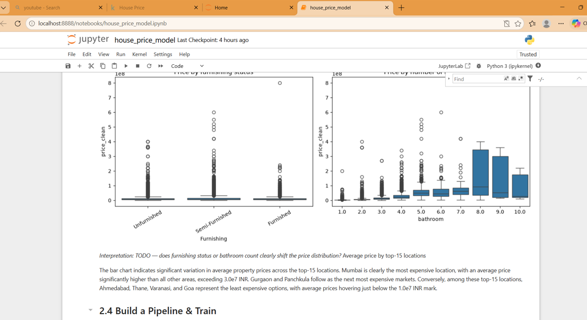 | 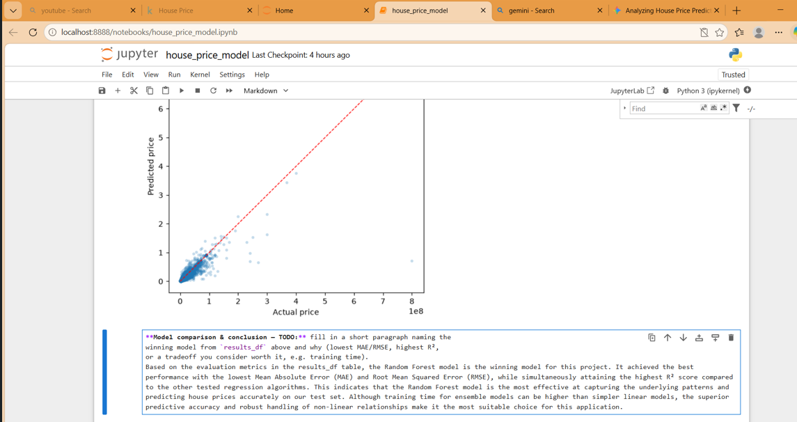 |

## Notes

- The exported pipeline predicts on the `log1p(price)` scale; the backend
  applies `np.expm1()` to convert back to a real INR price.
- High-cardinality `location` values are grouped into the top-50 most
  frequent locations plus `"other"` during training; unknown locations
  sent to the API are automatically mapped to `"other"`.
- scikit-learn version used for training: **1.9.0** (pinned in
  `backend/requirements.txt` to avoid pickle compatibility issues).
